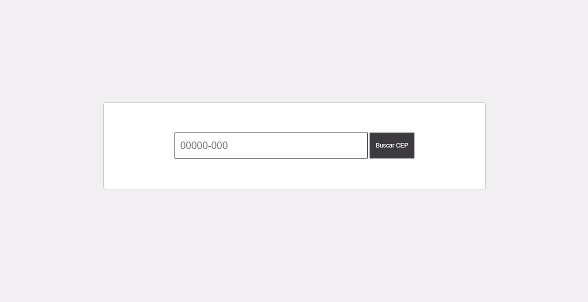

# Desafio frontend Petlove

Esse é um projeto com o objetivo de concluir o desafio da "Petlove" para frontend, consumindo uma Api de CEP

## Tabela de conteudo

- [Visão geral](#visao-geral)
  - [Descrição](#descrição)
  - [Screenshot](#screenshot)
  - [Links](#links)
  - [Como rodar o projeto local](#como-rodar)
- [Tecnologias](#tecnologias)
  - [Construido com](#construido-com)

## Visao-geral

### Descrição

- Esse desafio inclui fazer consumo de uma api quando o usuario colocar o valor no input
e colocar as informações na tela. 

### Screenshot

### Links

- Live Site URL: [Vercel live](buscadordecep-seven.vercel.app)
- Desafio: [Petlove](https://github.com/petlove/vagas/tree/master/frontend)

### Como rodar
- Faça um "git clone" do projeto para uma pasta local
- Rode o comando "npm install" para instalar dependencias do projeto
- Para rodar o servidor local utilize "npm run dev" 
- O projeto será aberto no em "http://localhost:5173"

## Tecnologias

### Construido com

- React
- TypeScript
- SASS
- HTML
- CSS(BEM)
- Jest